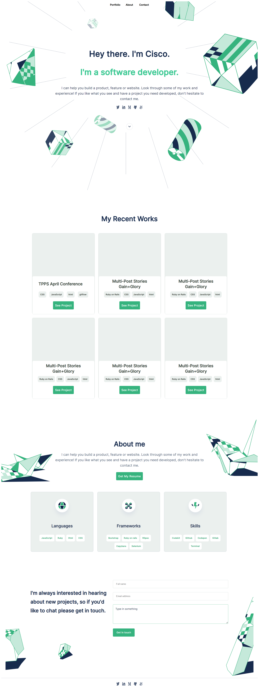

# Portfolio-Website

> - Created Html file.
- Successfully added all the elements in my chosen template.
- Created a CSS stylesheet.
- Replicated the style and design of my chosen template (template 3)
- Tested the website to see how well it responds.
- Ran a linter-style test and ensured it passed.
- Homepage

## Built With

- HTML
- CSS
- Github
- Gitflow
- Visual Studio Code

## Live Demo

[Live Demo Link](https://cisco-the-wayword.github.io/Personal-site/)

## Authors

👤 **Cisco**

- GitHub: [@githubhandle](https://github.com/Cisco-the-wayword)
- Twitter: [@twitterhandle](https://twitter.com/the_wayword1)
- LinkedIn: [LinkedIn](https://www.linkedin.com/in/boluwatife-adegboyega-9397a81b3/)

## 🤝 Contributing

Contributions, issues, and feature requests are welcome!

Feel free to check the [issues page](../../issues/).

## Show your support

Give a ⭐️ if you like this project!

## Acknowledgments

- Hat tip to anyone whose code was used
- Inspiration
- etc

## 📝 License

This project is [MIT](https://github.com/Cisco-the-wayword/Portfolio-Website/blob/5f8d3f40089dbd770ff825b3e90e45caaaaf663f/MIT.md) licensed.
